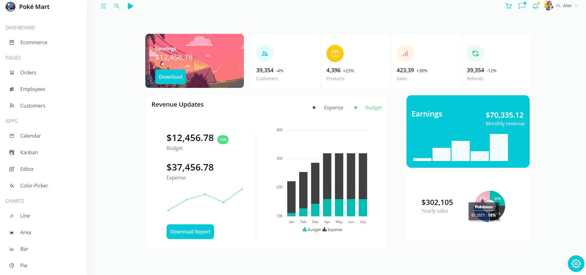
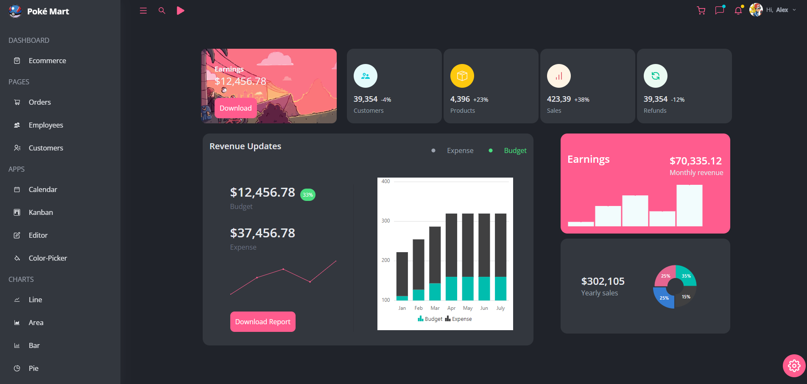
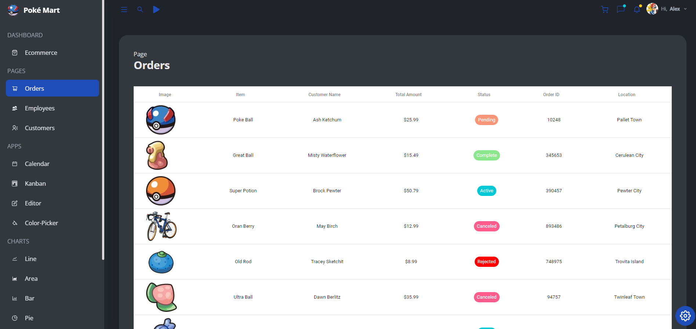
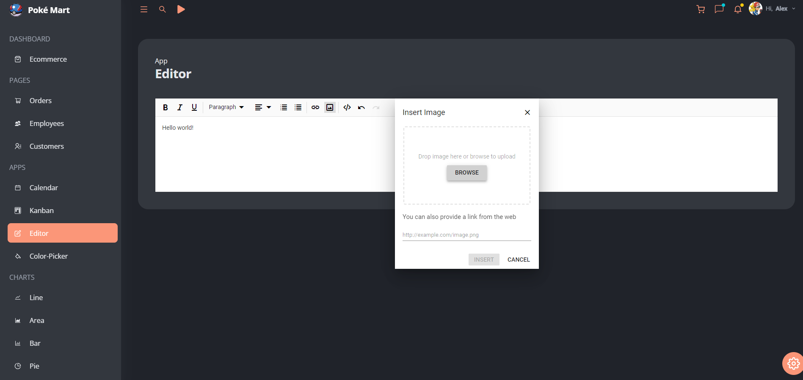
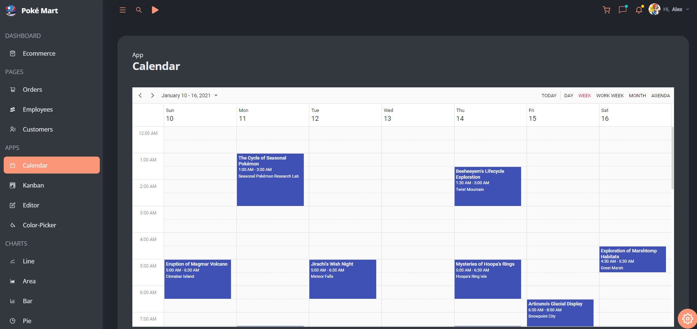
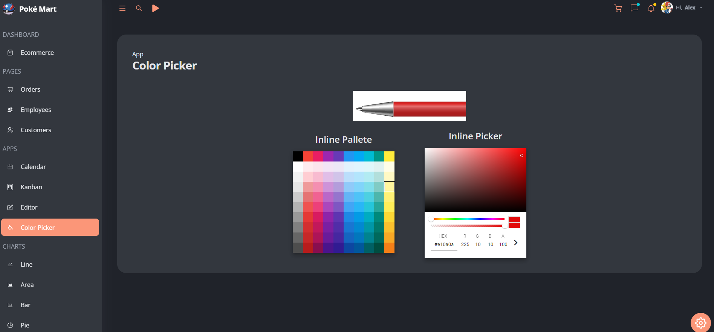
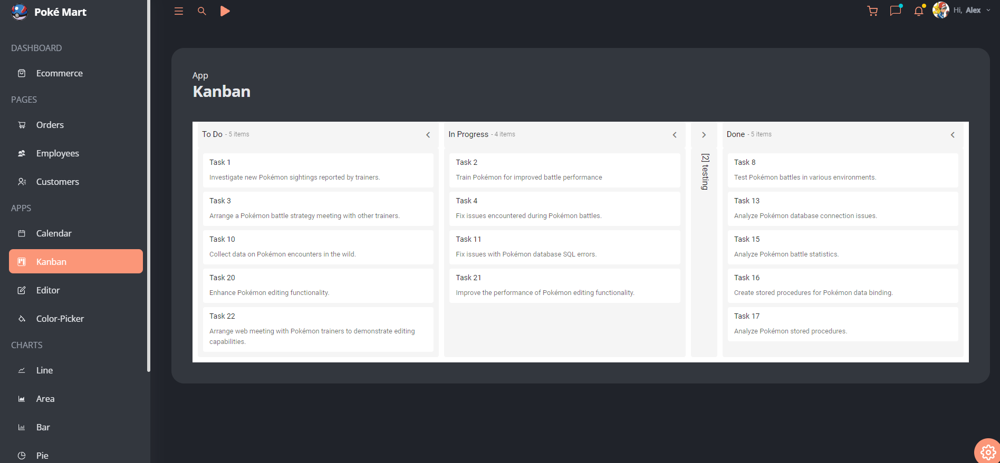

# Pokémon Poke Mart Dashboard

Welcome to the Pokémon Poke Mart Dashboard project! This dashboard is designed as a comprehensive management tool for a virtual Pokémon-themed store, equipped with various features and functionalities.

## Features

- **Pages:**
  - Ecommerce Home Page
  - Orders Page
  - Employees Page
  - Customers Page
- **Apps:**
  - Calendar App
  - Kanban App
  - WYSIWYG Editor App
  - Color Picker App
- **Charts:**
  - Line Chart
  - Area Chart
  - Bar Chart
  - Pie Chart
  - Financial Chart
  - Color-Mapped Chart
  - Pyramid Chart
  - Stacked Chart
- **Responsive Design:** Fully mobile responsive for seamless browsing on all devices.
- **Color Theming:** Customize the dashboard with different color themes.
- **Dark and Light Modes:** Switch between dark and light themes.
- **Music Integration:** Play the iconic Poke Mart song while using the dashboard.

## Technologies Used

- **React:** Frontend library for building user interfaces.
- **Synfusion Charts & Apps:** Used for creating a variety of interactive charts and apps.
- **Tailwind CSS:** Utility-first CSS framework for styling.

## Screenshots

### Homepage


### Dark Mode (Pink)


### Orders Page


### Customers Page


### WYSIWYG Editor App


### Calendar App


### Color Picker App


### Kanban App


### Pie Chart


### Wave Chart


## Getting Started

To get a local copy up and running follow these simple steps:

1. **Clone the repository:**
  ```shell
   git clone https://github.com/alexandurrr/PokeMart-Dashboard.git
  ``` 
2. **Install dependencies:**
  ```shell
   cd PokeMart-dashboard
   npm install
  ``` 
4. **Run the application:**
  ```shell
   npm start
  ``` 
5. **Open your browser:**
  ```shell
   http://localhost:3000
  ```


